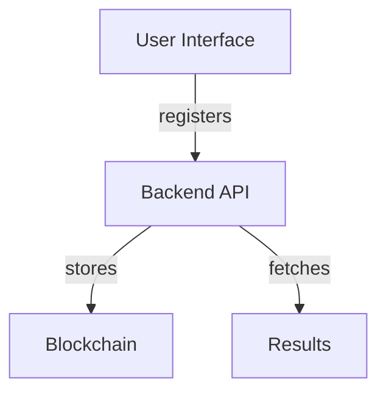

# Blockchain-Based Voting System Simulation

## Specification
A decentralized voting system using blockchain technology to ensure immutability and transparency.

## Architecture Diagram

## Setup Instructions
1. Clone the repository.
2. Navigate to the project directory.
3. Run `docker-compose up --build` to start the services.

## Testing Instructions
- Run `pytest` in the `backend` directory to execute tests.

## Key Features
- Register Voter: POST `/register_voter/`
- Add Candidate: POST `/add_candidate/`
- Cast Vote: POST `/cast_vote/`
- Get Results: GET `/results/`
